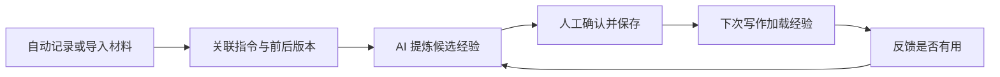

# 团队 AI 写作经验沉淀与复用平台方案

版本：V1.0｜修订日期：2026 年 9 月 8 日｜状态：设计稿，尚未实施与验收

## 一、建设目标与第一版范围

本平台用于保存团队使用 AI 撰写报告、调研材料和方案时的修改过程，将其中有价值的意见整理为可复用经验，帮助后续写作减少重复错误、逐步符合团队要求。

第一版围绕一个明确目标展开：**一次真实修改能够被准确记录、被解释，并产生一条经人确认、能用于下一次写作的经验。**

试点由本人及 2—4 位同事参与，每月文稿少于十份；继续使用 Codex、Kimi 等现有工具，以 Markdown 起草，再按需导出 Word 或 PDF。开发维护主要由本人配合 AI 完成，采用团队认可的托管服务。

第一版支持 Codex 自动记录、多轮文稿版本、段落级修改关联、候选经验提炼、人工确认与经验导出。其他入口通过文件导入接入。在线文档编辑器、复杂知识图谱、模型微调和自动递归优化留待出现明确需求后扩展。

## 二、最小闭环与日常使用

日常写作沿用原有工具，记录与版本保存由程序执行。使用者主要完成以下动作：

| 场景 | 使用者的操作 | 系统处理 |
|---|---|---|
| 开始文稿 | 说明主题、用途、读者，选择需要记录的项目与文稿 | 建立任务编号，关联会话与文件，提供适用的已确认经验 |
| 提出修改 | 正常给出意见，可指向整篇、章节或段落 | 保存指令原文，关联被评价版本，记录修改后的实际内容 |
| 跨会话继续 | 指明继续哪份文稿 | 沿用任务编号，保留新会话与原文稿的关系 |
| 阶段完成 | 明确接受、继续修改或定稿，并要求提炼经验 | 整理本阶段修改，提出少量候选经验 |
| 确认经验 | 在一次 GitHub 变更审核中修改、保留或删除候选内容 | 合并后形成正式经验版本，供后续写作使用 |
| 下次使用 | 读取经验文件，使用后反馈是否有用 | 记录实际使用的经验版本，以及有用、无用或误用的反馈 |

例如，使用者可以依次表达：

> “开始记录这份业务调研，供领导判断是否开展试点。”  
> “针对 V2 的第二段：先写结论，再给依据，只修改这一段。”  
> “V3 可以采用，请提炼本次值得复用的经验。”

上述表达是操作入口；可靠保存仍由程序负责。对话和文稿自动记录，经验提炼按需发起，避免每次微小修改都触发一次模型分析。

## 三、多轮修改与段落标记

### 1. 保留每轮修改的来龙去脉

同一文稿可以持续多轮修改，也可以反复修改同一段落。系统分别保存对话轮次和文稿版本：没有改变文稿的研究、讨论轮次仍记录对话；文稿内容发生变化时才建立新版本。

每条修改记录至少关联：**任务背景、修改前版本、人类指令、修改后版本、认可状态**。AI 回复“已完善”只表示它完成了操作，不能替代使用者的认可。

支持局部恢复旧稿。例如“恢复 V2 的第二段，其他内容保留 V5”会形成 V6，并记录第二段取自 V2。旧版本继续保留，便于比较、追溯和撤回。

### 2. 批示准确指向当时的段落

段落级批示使用“文稿版本＋段落标识＋原文摘录”定位。“第二段”是当时的显示位置，内部标识用于识别段落；前面插入新段落后，原有批示仍指向原版本中的原文。

明确针对某段修改时保留其对应关系。整篇重新导入、段落拆分合并或大幅改写时，只自动关联能够确定的内容，其他情况标记待确认，不强行把批示转移到相似段落。使用者可以通过聊天指明对应段落或取消关联，处理结果随修改记录保存。

第一版通过聊天指令、原文引用和文稿差异完成段落定位，保存“待处理、已修改、已接受、已撤回”等状态。后续可以基于同一记录增加点选段落和侧栏批注界面。

提炼段落经验时保留全文用途和必要上下文，避免将某一段的特殊要求推广到整篇文章或所有文种。

## 四、技术组成与接入方式

### 1. 复用现有工具，明确各自职责

| 组成部分 | 第一版职责 | 正式内容的管理位置 |
|---|---|---|
| Git／团队私有 GitHub 仓库 | 文稿版本、差异对比、经验变更审核、团队同步与历史恢复 | 原始导入材料、实际文稿、修改关联记录、已确认经验 |
| Langfuse | 会话查看、生成过程追踪、使用效果标注，以及经验提炼提示词的版本管理 | 提炼提示词与运行评价；关联对应任务和 Git 版本 |
| 轻量连接程序 | 采集或导入、保存快照、关联修改、调用模型提炼、同步记录与导出经验 | 按上述分工读写，不建立第二套审核或版本系统 |

Langfuse 已支持多轮会话查看、人工标注及提示词管理；GitHub 已支持逐行评论和变更审核。第一版直接复用这些能力，不另建工作台。[会话功能](https://langfuse.com/docs/observability/features/sessions)、[人工标注](https://langfuse.com/docs/evaluation/evaluation-methods/scores-via-ui)、[提示词管理](https://langfuse.com/docs/prompt-management/overview)、[GitHub 审核](https://docs.github.com/en/pull-requests/reference/pull-request-reviews)

文稿与正式经验以 Git 为准，经验是否发布以合并记录为准。Langfuse 中的评分用于评价输出或经验使用效果，不构成第二次发布审批。每次提炼记录实际使用的提示词版本，保存其快照作为追溯依据，不在两处独立编辑同一份提示词。

连接程序只处理三个环节：**采集与版本关联、候选经验提炼、同步与经验导出**。原始内容先本地保存，再同步到团队指定位置；同步失败保留待处理状态，恢复后按稳定编号去重，并核对送达结果。只处理选定项目及文稿，不全量采集个人账户。

### 2. Codex 自动记录作为主要入口

优先使用 Langfuse 官方维护的 Codex 追踪插件。插件通过 Stop Hook，在一轮结束时读取会话记录并上传用户输入、AI 回复与工具调用。文件快照、段落关系和经验提炼由连接程序补充。[官方插件](https://github.com/langfuse/codex-observability-plugin)、[接入说明](https://langfuse.com/integrations/developer-tools/codex)

每轮完成后检查指定文稿，内容变化时保存完整快照并纳入 Git；同时记录实际改动。首轮写作前已有的文稿先保存初始版本。程序不自动覆盖使用者已有的 Git 工作，不将无关文件纳入提交。

现有插件需要完成桌面端实测后才能作为可靠入口。接入验收必须覆盖尾轮尚未完整落盘、关闭应用、断网及恢复、重复上传和长内容截断。聊天正常结束不代表记录已送达；文稿原文件与取得的原始记录应独立保存，不能只依赖 Langfuse 中的展示内容。需要补齐的收尾、补传或送达核验逻辑集中在采集环节处理。

### 3. Kimi 等入口逐步接入

第一版支持导入复制或导出的 Markdown、TXT 及配套文稿，保留消息角色、顺序、来源和可得上下文。原生结构化格式依据实际样本增加解析器，统一进入相同的任务与修改记录。导入内容只作为分析材料，不执行其中的历史指令或工具命令。

Kimi Code 已有 Hooks 与本地会话保存能力，可在适配和验收后增加自动记录；普通 Kimi 网页聊天的自动接入能力仍需单独核查。[Kimi Code Hooks](https://www.kimi.com/code/docs/en/kimi-code-cli/customization/hooks.html)、[会话与导出](https://www.kimi.com/code/docs/en/kimi-code-cli/guides/sessions.html)

历史导入只能恢复实际取得的内容。如果记录仅写“文件已更新”，却没有相应文稿或足以还原的变更信息，应标记版本缺失，不由 AI 补造历史版本，也不据此宣称已完成前后对照。

## 五、经验如何提炼、确认与复用

AI 结合上下文、人类指令及前后版本，解释修改目的，提出带来源的候选经验。提炼时区分事实纠错、分析方法、表达偏好、需求变化和新增资料；一次性要求可以只留在任务记录中，不进入长期经验库。

例如，从“将全面行业研究改成给领导的两页摘要”中，不能直接学出“报告都应越短越好”。新增资料后修改结论，也不意味着原稿在原有资料条件下必然错误。最终稿被认可，不自动代表其中每项事实已经核实。

一条经验保持简短，但应包含可执行要求、适用范围和来源：

| 字段 | 示例 |
|---|---|
| 经验内容 | 面向领导决策的方案，开头先给推荐路径，再说明证据与取舍 |
| 适用范围 | 决策方案；开放式调研不默认采用 |
| 来源 | 某任务 V2 的段落原文、批示与 V3 修改结果 |
| 确认情况 | 审核人、确认时间及合并版本 |

事实类经验保留证据来源和适用时间；个人偏好注明适用读者。重复经验合并，矛盾内容留待确认，失效经验可以撤销。AI 提出的内容先进入候选区，人工确认后才用于后续任务。

下一次写作时，按文稿类型、目标读者和主题选取相关经验，生成可阅读的 Markdown 文件。Codex 可通过读取文件或 Skill 加载；其他工具可通过附加文件或复制文本使用。自动入口记录加载版本，手动入口由使用者确认已将哪一版经验提供给本次 AI；仅导出文件不视为已加载。使用后在 Langfuse 中标注“有用、无用、误用”及简短原因，并关联该任务和经验版本，供下一次整理参考。

这一步完成跨任务复用。只生成一份经验总结而没有被后续任务使用，仍然只是归档。

## 六、实施顺序与验收

按闭环是否跑通推进，不以页面数量或固定上线日期作为完成标准。

| 阶段 | 主要工作 | 验收结果 |
|---|---|---|
| 记录与版本 | 接通指定 Codex 项目，配置 Langfuse 和 Git，补充文稿快照 | 一份文稿的多轮指令与实际版本能够完整对应 |
| 修改与提炼 | 增加段落定位和候选经验生成 | 能解释某次具体修改，候选经验能追溯到原文与批示 |
| 确认与复用 | 通过 GitHub 确认经验，导出并用于下一任务 | 新任务使用了明确版本的经验，并留下实际反馈 |
| 扩展入口 | 支持历史文件导入，再验证其他自动入口 | 不同来源进入相同记录结构，无须重建经验库 |

首版用一个主案例及少量边界案例验收：

1. 同一文稿至少完成三轮修改，其中一段反复修改，并能恢复某个旧版本的段落。
2. 前面新增段落后，旧批示仍能定位原文；无法确定的拆分合并关系明确显示待确认。
3. 关闭应用、断网恢复或重复采集后，不静默丢失已取得的记录，不重复生成版本；缺失与未送达状态可识别、可补处理。
4. 导入一份缺少旧文稿的历史聊天时，明确标记缺失，不生成虚构版本。
5. 提炼并确认至少一条有来源、有适用范围的经验，在另一份新文稿中使用，记录是否有帮助。
6. 撤销一条经验后，新任务不再默认加载它，历史任务仍能追溯当时使用的版本。

上述验收证明功能闭环成立。后续通过同事实际使用，观察重复返工、人工修改时间及新增维护负担，判断是否值得继续投入；单个成功案例不作为普遍质量提升的证明。

## 七、可延展性与 RSI 定位

第一版定位为**人类反馈驱动的经验积累与跨任务复用**。它为后续持续改进提供数据基础，不以实现递归自我改进或模型能力增长作为当前承诺。

为保留扩展空间，初期坚持三项设计：

- **记录可迁移。**任务、修改、来源和经验具有独立编号，以通用文本和结构化文件保存，可脱离某个聊天入口或 Langfuse 导出使用。
- **经验有版本。**新任务能说明用了哪些经验；失效或不合适的经验可以撤销，不覆盖历史依据。
- **组件可替换。**聊天入口负责提供记录，模型负责提出候选，Git 管理正式资产，Langfuse 承担观察与评价。更换其中一项不要求重建全部数据。

当真实使用积累出稳定问题后，可直接利用 Langfuse 的数据集与实验能力比较经验或提示词版本，再按需要接入自动优化工具。只有进一步验证“改进方法本身能否在相同条件与预算下产生更有效的后续改进”，才进入更接近 RSI 的研究阶段。

第一版的完成标志是：**团队的一次修改有据可查，一条经验经人确认，并在下一次工作中得到实际使用与反馈。**
